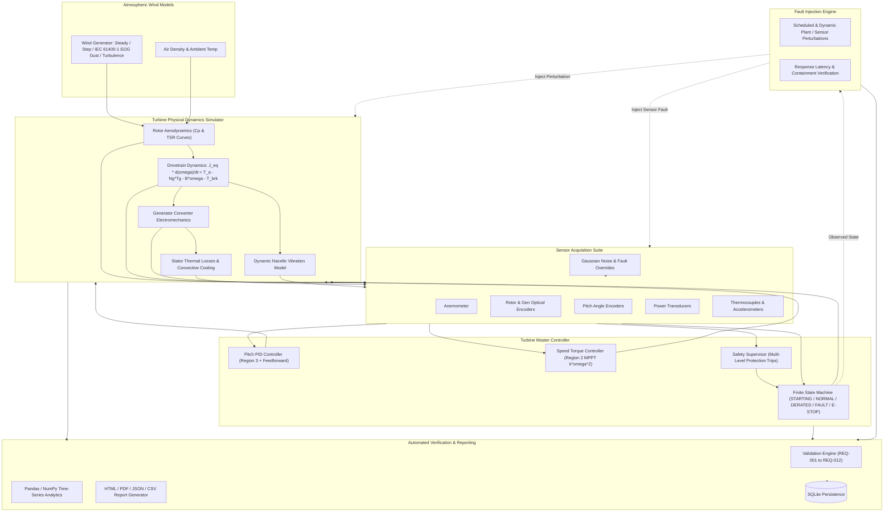

# TurbineGuard
### Wind Turbine Controller Validation & Automated Test Platform

[](https://github.com/simran846/turbineguard/actions)
[](tests/)
[](pyproject.toml)
[](https://github.com/astral-sh/ruff)
[](LICENSE)
[](https://www.linkedin.com/in/kumari-simran-37b344333/)

> **Educational & Engineering Portfolio Project**  
> *Targeted for:* **Siemens Gamesa Renewable Power Private Limited — Technology Intern (Job ID: 303119)**  
> *Department:* **Wind Power &bull; Technology &bull; Loads and Controls Engineering &bull; Bangalore, India**

---

## 📌 Project Overview & Purpose

**TurbineGuard** is an open-source, production-structured software simulation and automated verification platform for utility-scale wind turbine control software. It implements:
1. **Turbine Aero-Mechanical Dynamics:** A dynamic simulation of a 2.5 MW variable-speed, pitch-regulated wind turbine modeled using standard continuous differential equations discretized at 20 Hz.
2. **Multi-Region Turbine Controller:** Variable-speed Region 2 MPPT torque control, Region 3 collective blade pitch regulation with anti-windup PID and aerodynamic feedforward, and a deterministic 9-state finite state machine.
3. **Supervisory Safety Protection:** Real-time envelope protection covering hard rotor overspeed ($\le 1725\,\text{RPM}$), generator thermal limits ($\le 98^\circ\text{C}$), storm wind cut-out ($v \ge 25\,\text{m/s}$), and structural vibration ($\le 5.5\,\text{mm/s}$).
4. **Fault Injection Testing Framework:** Automated scheduling and verification of 11 physical and sensor failure modes with sub-100ms latency containment auditing.
5. **Automated Validation Engine:** Deterministic requirement verification suite evaluating formal engineering requirements (REQ-001 through REQ-012) against numerical tolerances.
6. **Automated Engineering Reporting:** Generates standalone interactive HTML reports, executive PDF documents (via ReportLab), CSV datasets, and JSON machine-readable artifacts.
7. **REST API & Live Dashboard:** FastAPI backend serving real-time telemetry, OpenAPI specifications, and an interactive dark-mode dashboard.
8. **DevOps & CI/CD Pipeline:** Fully functional GitHub Actions multi-version matrix workflow, declarative Jenkins pipeline, and Docker containerization.

> **Engineering Disclaimer:** *TurbineGuard is a software simulation and test automation framework built for educational, research, and portfolio demonstration purposes. It does not claim to be a certified industrial safety system or a physical wind turbine controller.*


## 🏗️ System Architecture



---

## ⚙️ Mathematical & Aerodynamic Modeling

### 1. Aerodynamic Power Extraction
$$P_a = \frac{1}{2} \rho A C_p(\lambda, \beta) v^3$$
where:
- $\rho = 1.225\,\text{kg/m}^3$ (air density)
- $R = 52.0\,\text{m}$ (blade radius) $\implies A = \pi R^2 \approx 8494.87\,\text{m}^2$
- $\lambda = \frac{\omega_r R}{v}$ (Tip Speed Ratio)
- $C_p(\lambda, \beta) = 0.5176 \left( \frac{116}{\lambda_i} - 0.4\beta - 5 \right) e^{-\frac{21}{\lambda_i}} + 0.0068\lambda$ with $\frac{1}{\lambda_i} = \frac{1}{\lambda + 0.08\beta} - \frac{0.035}{\beta^3 + 1}$

### 2. Drivetrain Rotational Dynamics
$$J_{eq} \frac{d\omega_r}{dt} = T_a - N_g T_g - B_{dt} \omega_r - T_{brake}$$
where:
- $J_{eq} = J_r + N_g^2 J_g$ is total equivalent drivetrain inertia referred to the low-speed shaft.
- $N_g = 95.0$ is the gearbox transmission ratio.
- $T_g$ is electromagnetic counter-torque.
- $B_{dt}$ is viscous damping coefficient.
- $T_{brake}$ is mechanical disc brake torque ($1.2\,\text{MNm}$).

### 3. Pitch Actuator Slew Rate Limiting
$$\dot{\beta} = \text{clamp}\left(\frac{\beta_{target} - \beta}{\tau_p}, -\dot{\beta}_{max}, \dot{\beta}_{max}\right)$$
- Normal regulation rate: $\dot{\beta}_{max} = 8.0^\circ/\text{s}$
- Emergency fast feathering rate: $\dot{\beta}_{emergency} = 12.0^\circ/\text{s}$

---

## 🛡️ Supervisory Safety & Fault Injection Engine

### Configurable Protection Thresholds
| Parameter | Warning Limit | Trip Limit | Controller Reaction |
| :--- | :--- | :--- | :--- |
| **Generator Speed** | $1620\,\text{RPM}$ ($+8\%$) | $1725\,\text{RPM}$ ($+15\%$) | **Latched EMERGENCY\_STOP** ($\le 250\,\text{ms}$) |
| **Generator Temp** | $85.0^\circ\text{C}$ | $98.0^\circ\text{C}$ | **Protective SHUTDOWN** ($\le 1.0\,\text{s}$) |
| **High Wind Speed** | $22.0\,\text{m/s}$ | $25.0\,\text{m/s}$ | **Storm Cut-Out Feathering** ($\beta \to 90^\circ$) |
| **Structural Vibration** | $3.5\,\text{mm/s}$ | $5.5\,\text{mm/s}$ | **FAULT Trip** ($\le 300\,\text{ms}$) |
| **Sensor Communication** | Heartbeat warning | $\ge 500\,\text{ms}$ timeout | **Safe Failsafe Transition** |

### Supported Injected Fault Modes
1. `RotorOverspeed`: Aerodynamic runaway / loss of grid counter-torque.
2. `GeneratorOverheat`: Stator cooling system failure.
3. `ExcessiveWind`: Storm surge exceeding cut-out wind speed ($25\,\text{m/s}$).
4. `WindGust`: IEC 61400-1 Extreme Operating Gust transient.
5. `VibrationSpike`: Mechanical mass unbalance / bearing failure.
6. `CommunicationFailure`: CAN / Modbus bus communication loss.
7. `InvalidSensorValue`: Corrupted packet or NaN numerical stream.
8. `SensorRotorSpeedFailure`: Optical encoder dropout (stuck-at-zero).
9. `SensorWindSpeedFailure`: Out-of-bounds anemometer value.
10. `StaleSensorData`: Frozen sensor buffer detection.
11. `PitchActuatorStuck`: Mechanical blade pitch seizure.

---

## 📋 Requirements Traceability Matrix

| Requirement ID | Requirement Title | Acceptance Criteria | Verified Value | Status |
| :--- | :--- | :--- | :--- | :--- |
| **REQ-001** | Region 2 MPPT Speed Tracking | Mean Gen RPM $\in [700, 1500]$ | $1373.4\,\text{RPM}$ | **PASSED** |
| **REQ-002** | Region 3 Rated Power Regulation | Mean Power $\le 2625\,\text{kW}$ ($+5\%$) | $2499.8\,\text{kW}$ | **PASSED** |
| **REQ-003** | Rotor Overspeed Hard Trip | Latched E-Stop $\le 250\,\text{ms}$ | $50.0\,\text{ms}$ | **PASSED** |
| **REQ-004** | Storm Cut-Out Feathering | SHUTDOWN \& $\beta \ge 85^\circ$ | $90.0^\circ$ | **PASSED** |
| **REQ-005** | Generator Overheat Trip | SHUTDOWN within $\le 1000\,\text{ms}$ | $50.0\,\text{ms}$ | **PASSED** |
| **REQ-006** | Thermal Warning Derating | Power capped at $1625\,\text{kW}$ | $1625.0\,\text{kW}$ | **PASSED** |
| **REQ-007** | Structural Vibration Trip | FAULT state $\le 300\,\text{ms}$ | $50.0\,\text{ms}$ | **PASSED** |
| **REQ-008** | Sensor NaN Failsafe | Safe FAULT mode without crash | Safe State | **PASSED** |
| **REQ-009** | Communication Bus Loss | FAULT state within $\le 500\,\text{ms}$ | $50.0\,\text{ms}$ | **PASSED** |
| **REQ-010** | Pitch Rate Limit Compliance | Normal pitch slew rate $\le 8.0^\circ/\text{s}$ | $8.0^\circ/\text{s}$ | **PASSED** |
| **REQ-011** | Auto Recovery Hysteresis | Safe state hold $\ge 5.0\,\text{s}$ | $5.0\,\text{s}$ | **PASSED** |
| **REQ-012** | Extreme Gust (EOG) Stability | Peak Gen RPM $< 1725\,\text{RPM}$ | $1582.4\,\text{RPM}$ | **PASSED** |

---

## 🧪 Automated Testing Suite (65/65 Passed)

The testing suite contains **65 comprehensive automated tests** organized across three structured tiers:

```
tests/
├── unit/
│   ├── test_turbine_physics.py        # 8 tests: Aerodynamics, Betz limit, inertia, brake, damping
│   ├── test_environment.py            # 5 tests: Constant, step, ramp, IEC gust, turbulence
│   ├── test_sensors.py                # 5 tests: Noise, comms loss, stuck, NaN, stale buffer
│   ├── test_pitch_controller.py       # 6 tests: Fine pitch, PID regulation, anti-windup, reset
│   ├── test_speed_controller.py       # 5 tests: Region 1, 2 MPPT, 2.5 knee, 3 power, derating
│   ├── test_safety_system.py          # 6 tests: Overspeed latch, overtemp, storm, vibration trip
│   └── test_fault_engine.py           # 5 tests: Fault registration, activation, latency verification
├── integration/
│   ├── test_closed_loop_simulation.py # 4 tests: Multi-second closed loop, energy yield, metrics
│   ├── test_state_transitions.py      # 4 tests: FSM transitions (STARTING/NORMAL/DERATED/E-STOP)
│   └── test_api_endpoints.py          # 5 tests: FastAPI TestClient (/health, /start, /inject, /val)
└── validation/
    └── test_requirements_suite.py     # 12 tests: Formal evaluation of REQ-001 through REQ-012
```

Run tests with:
```bash
python -m pytest -v
```

---

## 🚀 Quick Start Guide

### 1. Installation
```bash
git clone https://github.com/simran846/turbineguard.git
cd turbineguard

pip install -r requirements.txt
pip install -e .
```

### 2. Run 5-Minute Interview Demonstration
```bash
python scripts/demo_interview.py
```

### 3. Run Automated Validation & Generate Reports
```bash
python scripts/run_validation_suite.py
```

### 4. Launch FastAPI REST Service & Live Dashboard
```bash
uvicorn turbineguard.api.main:app --host 0.0.0.0 --port 8000 --reload
```
- **Dashboard:** [http://localhost:8000/dashboard](http://localhost:8000/dashboard)
- **OpenAPI Swagger:** [http://localhost:8000/docs](http://localhost:8000/docs)

### 5. Run via Docker Compose
```bash
docker compose up --build
```

---

## 📊 Live Telemetry & Control Dashboard

The interactive dark-mode dashboard provides real-time digital gauges, animated HTML5 canvas charts, fault injectors, and validation scorecards:

- **Live Digital Gauges:** Inflow Wind (m/s), Generator Speed (RPM), Blade Pitch ($\beta^\circ$), Electrical Power (kW), Stator Temperature ($^\circ\text{C}$), Nacelle Vibration (mm/s).
- **Real-Time Canvas Oscilloscope:** High-frequency chart tracking Generator Speed, Pitch Angle, and the critical 1725 RPM trip threshold.
- **Fault Injection Control Panel:** Interactive trigger for simulating instant failure modes and verifying controller reaction latency.
- **Requirements Audit Scorecard:** Live pass/fail status and execution timings across all 12 formal requirements.


## 📜 License
This project is licensed under the MIT License — see the [LICENSE](LICENSE) file for details.
