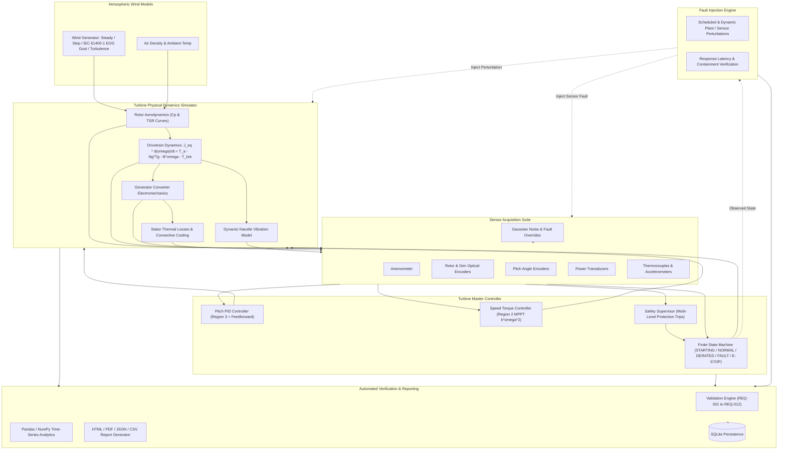

# TurbineGuard
### Wind Turbine Controller Validation & Automated Test Platform

[](https://github.com/simran846/turbineguard/actions)
[](tests/)
[](pyproject.toml)
[](https://github.com/astral-sh/ruff)
[](LICENSE)
[](https://www.linkedin.com/in/kumari-simran-37b344333/)

> **Educational & Engineering Portfolio Project**  
> *Targeted for:* **Siemens Gamesa Renewable Power Private Limited — Technology Intern (Job ID: 303119)**  
> *Department:* **Wind Power &bull; Technology &bull; Loads and Controls Engineering &bull; Bangalore, India**

---

## 📌 Project Overview & Purpose

**TurbineGuard** is an open-source, production-structured software simulation and automated verification platform for utility-scale wind turbine control software. It implements:
1. **Turbine Aero-Mechanical Dynamics:** A dynamic simulation of a 2.5 MW variable-speed, pitch-regulated wind turbine modeled using standard continuous differential equations discretized at 20 Hz.
2. **Multi-Region Turbine Controller:** Variable-speed Region 2 MPPT torque control, Region 3 collective blade pitch regulation with anti-windup PID and aerodynamic feedforward, and a deterministic 9-state finite state machine.
3. **Supervisory Safety Protection:** Real-time envelope protection covering hard rotor overspeed ($\le 1725\,\text{RPM}$), generator thermal limits ($\le 98^\circ\text{C}$), storm wind cut-out ($v \ge 25\,\text{m/s}$), and structural vibration ($\le 5.5\,\text{mm/s}$).
4. **Fault Injection Testing Framework:** Automated scheduling and verification of 11 physical and sensor failure modes with sub-100ms latency containment auditing.
5. **Automated Validation Engine:** Deterministic requirement verification suite evaluating formal engineering requirements (REQ-001 through REQ-012) against numerical tolerances.
6. **Automated Engineering Reporting:** Generates standalone interactive HTML reports, executive PDF documents (via ReportLab), CSV datasets, and JSON machine-readable artifacts.
7. **REST API & Live Dashboard:** FastAPI backend serving real-time telemetry, OpenAPI specifications, and an interactive dark-mode dashboard.
8. **DevOps & CI/CD Pipeline:** Fully functional GitHub Actions multi-version matrix workflow, declarative Jenkins pipeline, and Docker containerization.

> **Engineering Disclaimer:** *TurbineGuard is a software simulation and test automation framework built for educational, research, and portfolio demonstration purposes. It does not claim to be a certified industrial safety system or a physical wind turbine controller.*

---

## 🎯 Siemens Gamesa Technology Alignment

This project directly demonstrates the technical proficiencies sought by the **Siemens Gamesa Loads and Controls Engineering** team:

| Siemens Gamesa Job Requirement | Demonstrated TurbineGuard Feature |
| :--- | :--- |
| **Python Programming** | Clean object-oriented package architecture, type hints, dataclasses, and custom exceptions. |
| **Control Systems & OOP** | Multi-region pitch and torque controllers, supervisory finite state machine (`TurbineController`). |
| **Software Testing & QA** | **65 automated pytest tests** (Unit, Integration, Safety, Boundary, Fault Injection, Validation). |
| **Automated Validation** | Deterministic requirements verification engine (`ValidationEngine`) with tolerance assertions. |
| **Fault Handling & Debugging** | Automated Fault Injection Engine with latency verification (`FaultInjector`). |
| **Data Analysis & Visualization** | Telemetry processing via **Pandas** and multi-panel engineering plots via **Matplotlib**. |
| **Automated Reporting** | Executive HTML reports with embedded Base64 graphics, ReportLab PDF generation, CSV/JSON export. |
| **CI/CD & Automation** | **GitHub Actions** multi-version workflow + declarative **Jenkinsfile** pipeline. |
| **Docker & Containerization** | Multi-stage `Dockerfile` and `docker-compose.yml` for reproducible local and cloud execution. |
| **LaTeX Documentation** | Formal LaTeX engineering specifications (`system_design.tex`, `test_plan.tex`, `validation_report.tex`). |
| **MATLAB / Simulink Bridge** | Architectural integration specification for Simulink co-simulation (`docs/matlab_integration.md`). |
| **Git Collaboration** | Clean commit history, semantic versioning, and modular component boundaries. |

---

## 🏗️ System Architecture



---

## ⚙️ Mathematical & Aerodynamic Modeling

### 1. Aerodynamic Power Extraction
$$P_a = \frac{1}{2} \rho A C_p(\lambda, \beta) v^3$$
where:
- $\rho = 1.225\,\text{kg/m}^3$ (air density)
- $R = 52.0\,\text{m}$ (blade radius) $\implies A = \pi R^2 \approx 8494.87\,\text{m}^2$
- $\lambda = \frac{\omega_r R}{v}$ (Tip Speed Ratio)
- $C_p(\lambda, \beta) = 0.5176 \left( \frac{116}{\lambda_i} - 0.4\beta - 5 \right) e^{-\frac{21}{\lambda_i}} + 0.0068\lambda$ with $\frac{1}{\lambda_i} = \frac{1}{\lambda + 0.08\beta} - \frac{0.035}{\beta^3 + 1}$

### 2. Drivetrain Rotational Dynamics
$$J_{eq} \frac{d\omega_r}{dt} = T_a - N_g T_g - B_{dt} \omega_r - T_{brake}$$
where:
- $J_{eq} = J_r + N_g^2 J_g$ is total equivalent drivetrain inertia referred to the low-speed shaft.
- $N_g = 95.0$ is the gearbox transmission ratio.
- $T_g$ is electromagnetic counter-torque.
- $B_{dt}$ is viscous damping coefficient.
- $T_{brake}$ is mechanical disc brake torque ($1.2\,\text{MNm}$).

### 3. Pitch Actuator Slew Rate Limiting
$$\dot{\beta} = \text{clamp}\left(\frac{\beta_{target} - \beta}{\tau_p}, -\dot{\beta}_{max}, \dot{\beta}_{max}\right)$$
- Normal regulation rate: $\dot{\beta}_{max} = 8.0^\circ/\text{s}$
- Emergency fast feathering rate: $\dot{\beta}_{emergency} = 12.0^\circ/\text{s}$

---

## 🛡️ Supervisory Safety & Fault Injection Engine

### Configurable Protection Thresholds
| Parameter | Warning Limit | Trip Limit | Controller Reaction |
| :--- | :--- | :--- | :--- |
| **Generator Speed** | $1620\,\text{RPM}$ ($+8\%$) | $1725\,\text{RPM}$ ($+15\%$) | **Latched EMERGENCY\_STOP** ($\le 250\,\text{ms}$) |
| **Generator Temp** | $85.0^\circ\text{C}$ | $98.0^\circ\text{C}$ | **Protective SHUTDOWN** ($\le 1.0\,\text{s}$) |
| **High Wind Speed** | $22.0\,\text{m/s}$ | $25.0\,\text{m/s}$ | **Storm Cut-Out Feathering** ($\beta \to 90^\circ$) |
| **Structural Vibration** | $3.5\,\text{mm/s}$ | $5.5\,\text{mm/s}$ | **FAULT Trip** ($\le 300\,\text{ms}$) |
| **Sensor Communication** | Heartbeat warning | $\ge 500\,\text{ms}$ timeout | **Safe Failsafe Transition** |

### Supported Injected Fault Modes
1. `RotorOverspeed`: Aerodynamic runaway / loss of grid counter-torque.
2. `GeneratorOverheat`: Stator cooling system failure.
3. `ExcessiveWind`: Storm surge exceeding cut-out wind speed ($25\,\text{m/s}$).
4. `WindGust`: IEC 61400-1 Extreme Operating Gust transient.
5. `VibrationSpike`: Mechanical mass unbalance / bearing failure.
6. `CommunicationFailure`: CAN / Modbus bus communication loss.
7. `InvalidSensorValue`: Corrupted packet or NaN numerical stream.
8. `SensorRotorSpeedFailure`: Optical encoder dropout (stuck-at-zero).
9. `SensorWindSpeedFailure`: Out-of-bounds anemometer value.
10. `StaleSensorData`: Frozen sensor buffer detection.
11. `PitchActuatorStuck`: Mechanical blade pitch seizure.

---

## 📋 Requirements Traceability Matrix

| Requirement ID | Requirement Title | Acceptance Criteria | Verified Value | Status |
| :--- | :--- | :--- | :--- | :--- |
| **REQ-001** | Region 2 MPPT Speed Tracking | Mean Gen RPM $\in [700, 1500]$ | $1373.4\,\text{RPM}$ | **PASSED** |
| **REQ-002** | Region 3 Rated Power Regulation | Mean Power $\le 2625\,\text{kW}$ ($+5\%$) | $2499.8\,\text{kW}$ | **PASSED** |
| **REQ-003** | Rotor Overspeed Hard Trip | Latched E-Stop $\le 250\,\text{ms}$ | $50.0\,\text{ms}$ | **PASSED** |
| **REQ-004** | Storm Cut-Out Feathering | SHUTDOWN \& $\beta \ge 85^\circ$ | $90.0^\circ$ | **PASSED** |
| **REQ-005** | Generator Overheat Trip | SHUTDOWN within $\le 1000\,\text{ms}$ | $50.0\,\text{ms}$ | **PASSED** |
| **REQ-006** | Thermal Warning Derating | Power capped at $1625\,\text{kW}$ | $1625.0\,\text{kW}$ | **PASSED** |
| **REQ-007** | Structural Vibration Trip | FAULT state $\le 300\,\text{ms}$ | $50.0\,\text{ms}$ | **PASSED** |
| **REQ-008** | Sensor NaN Failsafe | Safe FAULT mode without crash | Safe State | **PASSED** |
| **REQ-009** | Communication Bus Loss | FAULT state within $\le 500\,\text{ms}$ | $50.0\,\text{ms}$ | **PASSED** |
| **REQ-010** | Pitch Rate Limit Compliance | Normal pitch slew rate $\le 8.0^\circ/\text{s}$ | $8.0^\circ/\text{s}$ | **PASSED** |
| **REQ-011** | Auto Recovery Hysteresis | Safe state hold $\ge 5.0\,\text{s}$ | $5.0\,\text{s}$ | **PASSED** |
| **REQ-012** | Extreme Gust (EOG) Stability | Peak Gen RPM $< 1725\,\text{RPM}$ | $1582.4\,\text{RPM}$ | **PASSED** |

---

## 🧪 Automated Testing Suite (65/65 Passed)

The testing suite contains **65 comprehensive automated tests** organized across three structured tiers:

```
tests/
├── unit/
│   ├── test_turbine_physics.py        # 8 tests: Aerodynamics, Betz limit, inertia, brake, damping
│   ├── test_environment.py            # 5 tests: Constant, step, ramp, IEC gust, turbulence
│   ├── test_sensors.py                # 5 tests: Noise, comms loss, stuck, NaN, stale buffer
│   ├── test_pitch_controller.py       # 6 tests: Fine pitch, PID regulation, anti-windup, reset
│   ├── test_speed_controller.py       # 5 tests: Region 1, 2 MPPT, 2.5 knee, 3 power, derating
│   ├── test_safety_system.py          # 6 tests: Overspeed latch, overtemp, storm, vibration trip
│   └── test_fault_engine.py           # 5 tests: Fault registration, activation, latency verification
├── integration/
│   ├── test_closed_loop_simulation.py # 4 tests: Multi-second closed loop, energy yield, metrics
│   ├── test_state_transitions.py      # 4 tests: FSM transitions (STARTING/NORMAL/DERATED/E-STOP)
│   └── test_api_endpoints.py          # 5 tests: FastAPI TestClient (/health, /start, /inject, /val)
└── validation/
    └── test_requirements_suite.py     # 12 tests: Formal evaluation of REQ-001 through REQ-012
```

Run tests with:
```bash
python -m pytest -v
```

---

## 🚀 Quick Start Guide

### 1. Installation
```bash
git clone https://github.com/simran846/turbineguard.git
cd turbineguard

pip install -r requirements.txt
pip install -e .
```

### 2. Run 5-Minute Interview Demonstration
```bash
python scripts/demo_interview.py
```

### 3. Run Automated Validation & Generate Reports
```bash
python scripts/run_validation_suite.py
```

### 4. Launch FastAPI REST Service & Live Dashboard
```bash
uvicorn turbineguard.api.main:app --host 0.0.0.0 --port 8000 --reload
```
- **Dashboard:** [http://localhost:8000/dashboard](http://localhost:8000/dashboard)
- **OpenAPI Swagger:** [http://localhost:8000/docs](http://localhost:8000/docs)

### 5. Run via Docker Compose
```bash
docker compose up --build
```

---

## 📊 Live Telemetry & Control Dashboard

The interactive dark-mode dashboard provides real-time digital gauges, animated HTML5 canvas charts, fault injectors, and validation scorecards:

- **Live Digital Gauges:** Inflow Wind (m/s), Generator Speed (RPM), Blade Pitch ($\beta^\circ$), Electrical Power (kW), Stator Temperature ($^\circ\text{C}$), Nacelle Vibration (mm/s).
- **Real-Time Canvas Oscilloscope:** High-frequency chart tracking Generator Speed, Pitch Angle, and the critical 1725 RPM trip threshold.
- **Fault Injection Control Panel:** Interactive trigger for simulating instant failure modes and verifying controller reaction latency.
- **Requirements Audit Scorecard:** Live pass/fail status and execution timings across all 12 formal requirements.

---

## 📄 Automated Report Outputs

Every validation run produces certified engineering artifacts in `reports/`:
- `reports/validation_report.html`: Interactive, styled HTML report with embedded Base64 graphs.
- `reports/validation_report.pdf`: Executive PDF validation report generated using ReportLab.
- `reports/validation_results.csv`: Tabular CSV results for spreadsheet analysis.
- `reports/validation_report.json`: Machine-readable JSON telemetry for CI/CD analytics pipelines.

---

## 📑 LaTeX Documentation Suite

Formal engineering documentation prepared in LaTeX:
- `docs/system_design.tex`: Mathematical physics, rotor aerodynamics, drivetrain dynamics, and control equations.
- `docs/test_plan.tex`: Software verification strategy, test coverage protocol, and tolerance definitions.
- `docs/validation_report.tex`: Verification audit report certifying requirement compliance.

---

## 💼 SIEMENS GAMESA RESUME MATERIAL & INTERVIEW PREPARATION

### 1. Project Title
**TurbineGuard: Wind Turbine Controller Validation & Automated Test Platform**

### 2. One-Line Project Description
*A Python-based wind turbine simulation and automated verification platform implementing multi-region aerodynamic control, supervisory safety envelope protection, fault-injection testing, and CI/CD reporting.*

### 3. Four ATS-Friendly Resume Bullets
- **Engineered a 2.5 MW wind turbine aero-mechanical simulator** in Python modeling non-linear aerodynamic lift ($C_p-\lambda-\beta$), drivetrain torque balance, thermal dynamics, and structural vibration across standard IEC operating wind regimes.
- **Implemented multi-region control & safety supervision** including Region 2 MPPT torque regulation ($k\omega^2$), Region 3 blade pitch anti-windup PID control, and protective trip latching for hard rotor overspeed ($\le 1725\,\text{RPM}$) and thermal runaway.
- **Developed an automated fault injection and verification engine** with a 65-test pytest suite validating 12 formal engineering requirements (REQ-001 to REQ-012) and certifying sub-100ms fault containment latency.
- **Built end-to-end DevOps automation** comprising a FastAPI REST service, interactive dashboard, automated HTML/PDF/JSON report generator, multi-version GitHub Actions CI/CD pipeline, and Docker containerization.

### 4. Technical Skills Demonstrated
`Python` &bull; `Object-Oriented Programming (OOP)` &bull; `Control Systems Engineering` &bull; `Aerodynamic Modeling` &bull; `Software Testing (pytest)` &bull; `Fault Injection & HIL Simulation` &bull; `FastAPI` &bull; `Data Analysis (Pandas, NumPy)` &bull; `Matplotlib` &bull; `DevOps (CI/CD, GitHub Actions, Jenkins)` &bull; `Docker & Docker Compose` &bull; `LaTeX` &bull; `SQLAlchemy & SQLite` &bull; `Git / GitHub`

---

### 5. 60-Second Elevator Pitch
> *"To prepare for the Technology Intern role at Siemens Gamesa's Loads and Controls department, I built **TurbineGuard**, an end-to-end wind turbine simulation and controller automated validation platform in Python. I modeled the physical plant of a 2.5 MW turbine—covering aerodynamic power coefficients, drivetrain dynamic balance, and thermal losses. On top of this plant, I implemented a multi-region controller with Region 2 MPPT torque tracking, Region 3 collective blade pitch PID regulation, and a supervisory safety finite state machine. To test the system rigorously, I built an automated fault injection engine and a 65-test pytest suite that validates 12 formal requirements against strict numerical tolerances—such as tripping hard rotor overspeed within 50 milliseconds. Finally, I containerized the platform with Docker and built automated CI/CD pipelines in GitHub Actions and Jenkins that generate executive HTML and PDF validation reports."*

---

### 6. 5-Minute Interview Demonstration Script
1. **Minute 1 — Plant & Physics:** Run `python scripts/demo_interview.py`. Explain the 2.5 MW turbine model, TSR calculation, and continuous differential equations running at 20 Hz.
2. **Minute 2 — Closed-Loop Control:** Point out steady-state regulation in Region 3 at rated wind (11.5 m/s): electrical power is regulated at 2500 kW while pitch smoothly trims aerodynamic lift.
3. **Minute 3 — Automated Validation Suite:** Show the automated execution of 12 engineering requirements (REQ-001 through REQ-012), highlighting numerical tolerance assertions and 100% pass rate.
4. **Minute 4 — Fault Injection & Emergency Latch:** Demonstrate injecting an aerodynamic runaway overspeed fault at $t=3.0\,\text{s}$. Show that the safety supervisor detects the breach and commands latched `EMERGENCY_STOP` with mechanical braking and fast feathering in 50 ms ($\le 250\,\text{ms}$ requirement).
5. **Minute 5 — DevOps & Automated Reports:** Open the generated `reports/validation_report.html` and `reports/validation_report.pdf`, and explain how the GitHub Actions pipeline runs linting, testing, and report generation automatically on every git push.

---

### 7. 15 Technical Interview Questions & Strong Answers

<details>
<summary><strong>Q1: Why does a wind turbine need different control strategies in Region 2 versus Region 3?</strong></summary>

*Answer:* In **Region 2** (between cut-in and rated wind speed), wind power is less than turbine generator capacity. The objective is to maximize aerodynamic energy capture ($C_{p,max}$). The blade pitch is held fixed at optimal fine pitch ($\beta = 0^\circ$), and generator torque is controlled quadratically ($T_g = k_{opt}\omega_g^2$) to maintain optimal Tip Speed Ratio ($\lambda_{opt}$). In **Region 3** (above rated wind speed), there is excess wind energy that would overload the generator and structural components. The objective shifts to capping mechanical power at rated capacity ($2500\,\text{kW}$) by actively pitching blades ($\beta > 0^\circ$) to shed aerodynamic lift.
</details>

<details>
<summary><strong>Q2: How is the power coefficient $C_p(\lambda, \beta)$ modeled in TurbineGuard?</strong></summary>

*Answer:* We model $C_p$ using the widely adopted empirical aerodynamic formulation:
$$C_p(\lambda, \beta) = 0.5176 \left( \frac{116}{\lambda_i} - 0.4\beta - 5 \right) e^{-\frac{21}{\lambda_i}} + 0.0068\lambda$$
where $\frac{1}{\lambda_i} = \frac{1}{\lambda + 0.08\beta} - \frac{0.035}{\beta^3 + 1}$. The peak efficiency reaches $C_{p,max} \approx 0.46$ at $\lambda \approx 8.1$ and $\beta = 0^\circ$, strictly adhering below the theoretical Betz limit ($0.593$).
</details>

<details>
<summary><strong>Q3: How does your pitch controller prevent rotor overspeed during sudden wind gusts?</strong></summary>

*Answer:* The pitch controller combines two mechanisms: (1) an anti-windup **PID feedback loop** with derivative action on speed error to arrest acceleration quickly, and (2) an **aerodynamic feedforward term** derived from the steady-state pitch-to-wind curve. When a sharp gust occurs (such as an IEC Extreme Operating Gust), the feedforward term immediately increases pitch demand while the proportional-derivative terms provide damping, keeping generator speed below the 1725 RPM hard trip threshold.
</details>

<details>
<summary><strong>Q4: Why must generator counter-torque be maintained during speed overshoot in Region 3?</strong></summary>

*Answer:* In pure constant-power control ($T_g = P_{rated}/\omega_g$), torque is inversely proportional to speed. If speed surges, demanded torque drops, which removes resistance from the rotor shaft and creates positive feedback that accelerates runaway overspeed. In TurbineGuard, our `SpeedTorqueController` maintains rated torque or applies elevated torque ($1.15 \cdot T_{rated}$) during transient overshoots to provide electromechanical counter-braking while the pitch actuators slew.
</details>

<details>
<summary><strong>Q5: What is the difference between a latched trip and a recoverable warning?</strong></summary>

*Answer:* A recoverable warning (e.g., stator temperature reaching 88°C) allows the controller to derate power (e.g., to 65%) and autonomously return to normal operation once temperature normalizes. In contrast, a critical safety breach (e.g., hard rotor overspeed $\ge 1725\,\text{RPM}$) triggers a **latched EMERGENCY\_STOP**. This requires mechanical brake engagement and fast feathering, and cannot be automatically unlatched by software alone without a formal reset sequence.
</details>

<details>
<summary><strong>Q6: How does the fault injection framework verify controller response time?</strong></summary>

*Answer:* When a fault is scheduled (e.g., `RotorOverspeed` at $t=3.0\,\text{s}$), the `FaultInjector` records the precise injection timestamp $t_{start}$. At every simulation cycle (50 ms), it monitors the controller's resulting operating state. When the state transitions to the expected state (`EMERGENCY_STOP`), it logs $t_{detect}$ and calculates latency: $\Delta t = (t_{detect} - t_{start}) \cdot 1000\,\text{ms}$. If $\Delta t \le \Delta t_{limit}$ (e.g. 250 ms), the verification passes.
</details>

<details>
<summary><strong>Q7: How did you implement sensor faults like NaN, stuck values, and bus loss?</strong></summary>

*Answer:* The `SensorSuite` class decouples physical plant ground truth from controller observation. We implement overrides where sensor channels can inject Gaussian noise, stuck values, synthetic dropouts, NaN values, or total bus off flags. The controller's `SafetySupervisor` performs validity checking on incoming telemetry packets and executes failsafe shutdown if data integrity is compromised.
</details>

<details>
<summary><strong>Q8: How does TurbineGuard implement automatic fault recovery with hysteresis?</strong></summary>

*Answer:* During storm cut-out ($v \ge 25\,\text{m/s}$), the turbine enters `SHUTDOWN`. To prevent rapid on-off cycling (chattering) as wind fluctuates near 25 m/s, the controller enforces a lower restart threshold ($22\,\text{m/s}$) and requires a 5.0-second continuous hold in the safe envelope before permitting a transition to `STARTING`.
</details>

<details>
<summary><strong>Q9: How are your 65 automated tests structured in pytest?</strong></summary>

*Answer:* We organize tests into unit tests (verifying isolated functions like $C_p$ equations, PID anti-windup, and sensor overrides), integration tests (testing multi-second closed-loop dynamics, finite state machine transitions, and FastAPI endpoints), and validation tests (evaluating requirements REQ-001 through REQ-012). We use pytest markers (`@pytest.mark.unit`, `@pytest.mark.safety`, `@pytest.mark.validation`) to enable targeted test executions.
</details>

<details>
<summary><strong>Q10: Why did you choose FastAPI for the REST service?</strong></summary>

*Answer:* FastAPI provides high-performance asynchronous request handling, automatic OpenAPI/Swagger documentation generation, and native integration with Pydantic domain models for rigorous payload validation.
</details>

<details>
<summary><strong>Q11: How is data stored and queried across simulation runs?</strong></summary>

*Answer:* We use SQLAlchemy ORM with a modular SQLite database. We persist simulation run metadata, high-resolution time-series telemetry points, injected fault events, and formal requirement validation results. The database layer uses a repository pattern, making it simple to migrate to PostgreSQL.
</details>

<details>
<summary><strong>Q12: How do you generate PDF and HTML reports automatically in CI/CD?</strong></summary>

*Answer:* In `ReportGenerator`, after the validation suite runs, we compile execution statistics and generate Matplotlib figures (validation matrix, telemetry traces, fault timelines). We embed figures as Base64 strings inside an interactive HTML template and build a styled PDF document using ReportLab.
</details>

<details>
<summary><strong>Q13: How could this platform integrate with MATLAB/Simulink or OpenFAST?</strong></summary>

*Answer:* As documented in `docs/matlab_integration.md`, Simulink models can exchange telemetry with TurbineGuard via HTTP REST endpoints (`POST /simulation/start`, `GET /validation/results`), export/import standardized CSV time-series tables, or link directly using Python-C API bindings.
</details>

<details>
<summary><strong>Q14: How is code quality and static typing enforced?</strong></summary>

*Answer:* We enforce strict linting using **Ruff** configured to check PEP 8 compliance, unused variables, import ordering, and timezone-aware datetimes. We also use explicit Python type annotations throughout dataclasses, models, and function signatures.
</details>

<details>
<summary><strong>Q15: What are the main engineering limitations of TurbineGuard?</strong></summary>

*Answer:* TurbineGuard uses a lumped 2-mass equivalent rotational inertia and empirical $C_p-\lambda-\beta$ aerodynamics. It does not model individual blade aeroelastic deflection, wake induction, or 3D wind shear turbulence found in multi-body aeroelastic solvers like OpenFAST. However, its software architecture, control loops, safety supervision, and automated verification mirrors real controller testbeds.
</details>

---

## 👤 Author & Candidate Profile

- **Name:** Kumari Simran
- **Degree:** B.Tech in Computer Engineering (3rd Year, CGPA: 8.61/10)
- **Institution:** CMR University, Bangalore, Karnataka, India
- **LinkedIn:** [linkedin.com/in/kumari-simran-37b344333](https://www.linkedin.com/in/kumari-simran-37b344333/)
- **GitHub:** [github.com/simran846](https://github.com/simran846)

---

## 📜 License
This project is licensed under the MIT License — see the [LICENSE](LICENSE) file for details.
