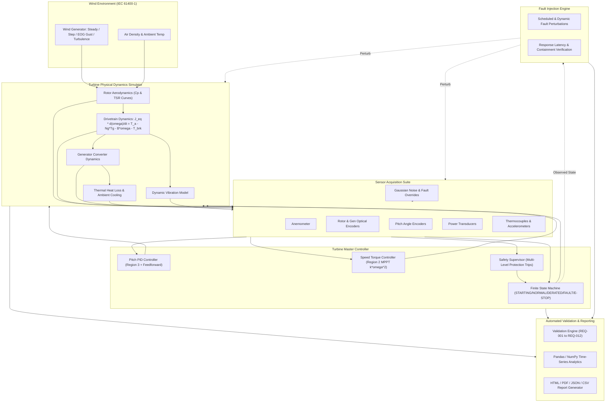

# TurbineGuard System Architecture & Engineering Design

## Subsystem Architectural Breakdown

### 1. Aerodynamic and Rotor Physics (`turbine.py`)
- **Swept Area:** $A = \pi R^2 = 8494.87\,\text{m}^2$ (for $R = 52.0\,\text{m}$).
- **Tip Speed Ratio (TSR):** $\lambda = \frac{\omega_r R}{v}$.
- **Empirical Power Coefficient:** $C_p(\lambda, \beta)$ empirical formulation bounded by the theoretical Betz limit ($0.593$) and practical operational maximum ($0.48$).
- **Aerodynamic Power & Torque:**
  $$P_a = \frac{1}{2} \rho A C_p(\lambda, \beta) v^3, \quad T_a = \frac{P_a}{\omega_r}$$

### 2. Multi-Region Turbine Control Logic (`controller/`)
- **Region 1 (Below Cut-In, $v < 3.0\,\text{m/s}$):** Idling and start-up preparation.
- **Region 2 (Variable Speed MPPT, $3.0\,\text{m/s} \le v < 11.5\,\text{m/s}$):**
  Blade pitch fixed at optimal fine pitch ($\beta = 0^\circ$). Generator counter-torque tracks maximum efficiency trajectory:
  $$T_{gen} = k_{opt} \cdot \omega_g^2, \quad \text{where } k_{opt} = \frac{1}{2} \rho \pi R^5 \frac{C_{p,max}}{\lambda_{opt}^3 N_g^3}$$
- **Region 3 (Pitch Regulation Above Rated, $v \ge 11.5\,\text{m/s}$):**
  Collective blade pitch angle $\beta$ is modulated via anti-windup PID and feedforward control to maintain constant rated power ($2500\,\text{kW}$) and generator speed ($1500\,\text{RPM}$).
- **Region 4 (Storm Cut-Out, $v \ge 25.0\,\text{m/s}$):** Full aerodynamic feathering ($\beta = 90^\circ$) to safely shut down.

### 3. Supervisory Safety and Envelope Protection (`safety_controller.py`)
Independent real-time safety loop executing continuous protection checks:
- **Hard Overspeed Trip:** Generator speed $\ge 1725\,\text{RPM}$ ($+15\%$) triggers latched `EMERGENCY_STOP` with mechanical brake engagement and fast feathering ($12^\circ/\text{s}$).
- **Thermal Overheat Trip:** Generator temperature $\ge 98.0^\circ\text{C}$ initiates safe `SHUTDOWN`.
- **Thermal High Warning Derating:** $85.0^\circ\text{C} \le T_g < 98.0^\circ\text{C}$ throttles turbine to $65\%$ capacity ($1625\,\text{kW}$).
- **Structural Vibration Trip:** Nacelle vibration $\ge 5.5\,\text{mm/s}$ triggers `FAULT` mode.
- **Sensor Failsafe:** Detection of NaNs, out-of-bounds dropouts, or communication bus timeouts ($\ge 500\,\text{ms}$) initiates safe failsafe shutdown.
